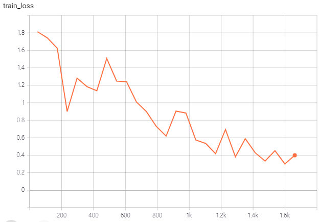

## Model 설명

https://blog.airlab.re.kr/2019/09/R(2+1)D

R(2+1)D-RGB, 키네틱스로 사전 훈련 후 HMDB51 적용시:

74.5

## 데이터셋

전체 클립: 3919

채널: 3

클립당 프레임: 8(영상 길이와 무관하게 추출)

W, H: 112

### HMDB51에서 다음 25가지 클래스로 구성:

## 결과

배치 사이즈 64, 에폭 21

## Project Structure

공통적으로 아래처럼 구성:

- data:
  - raw
  - processed
- notebooks
- model
- src
- practices

### 참고

https://towardsdatascience.com/structure-your-data-science-projects-6c6c8653c16a
https://dzone.com/articles/data-science-project-folder-structure
https://towardsdatascience.com/manage-your-data-science-project-structure-in-early-stage-95f91d4d0600
